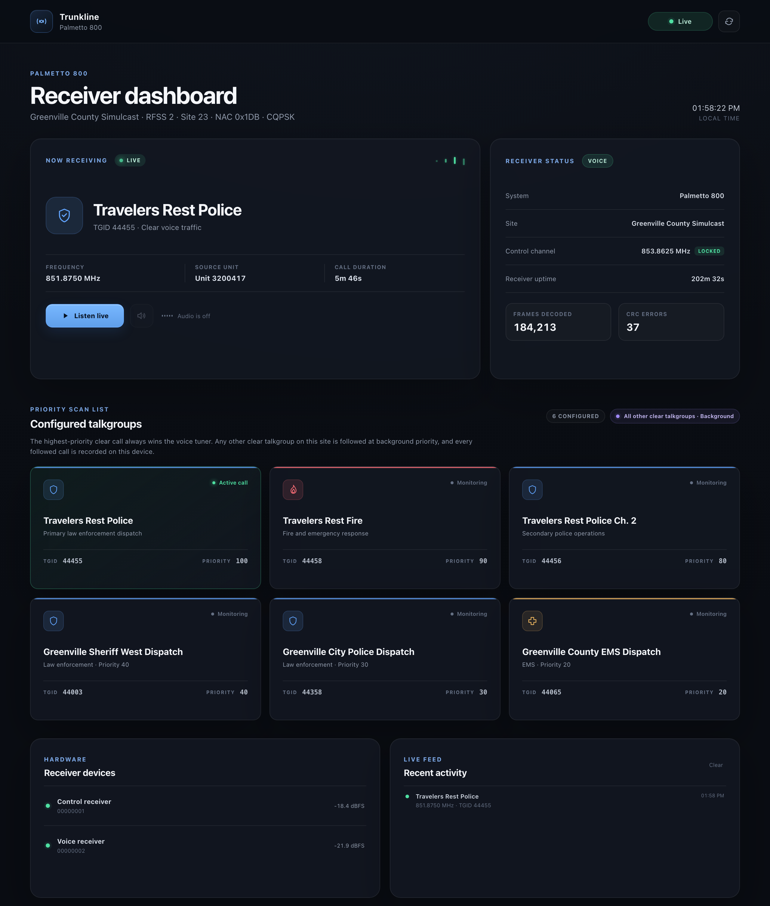

<div align="center">

# Trunkline

**A pure-Rust P25 Phase 1 trunked radio receiver you run in a browser.**

Two RTL-SDR dongles in, live dispatch audio and searchable transcripts out.
No GNU Radio, no SDRTrunk, no OP25, no `librtlsdr`: every stage from USB
bytes to decoded IMBE voice is Rust in this repository.

[](https://github.com/dawilco/trunkline/actions/workflows/ci.yml)
[](LICENSE)
[](Cargo.toml)
[](crates/radio-core/src/lib.rs)



<sub>Dashboard while following a call. <a href="docs/screenshot-full.png">Full page</a> including the archive and transcripts.</sub>

</div>

---

## What it does

Trunkline sits on a P25 trunked radio system the way a commercial scanner
does, but as a small headless service with a web dashboard:

- **Dual-tuner trunk tracking.** One RTL-SDR stays locked to the control
  channel and decodes the trunking signalling (TSBKs). The other retunes to
  whatever voice channel the highest-priority talkgroup was just granted.
- **Priority scanning that understands patches.** Talkgroups have priorities;
  a higher-priority call preempts a lower one mid-transmission. Motorola
  ASTRO 25 patch groups (dispatch temporarily merging talkgroups into a
  supergroup) are resolved recursively, so a configured talkgroup is still
  followed while it is patched.
- **Live audio in the browser.** Decoded IMBE voice is streamed as 8 kHz PCM
  over a WebSocket into an `AudioWorklet` jitter buffer with sequence-gap
  tracking. Click *Listen live* and leave the tab open.
- **On-device archive and transcription.** Every followed call is written as a
  WAV plus a JSON sidecar and transcribed locally with whisper.cpp. Nothing
  leaves the machine.
- **Encryption-aware.** Encrypted calls are detected from the voice header,
  link control, and encryption sync and are muted, skipped, and labelled.
  Trunkline never attempts decryption.
- **Reproducible offline decoding.** Raw IQ can be captured to SigMF and
  replayed through the exact production DSP chain. The test suite decodes a
  real control-channel capture on every CI run with no hardware attached.

## Quick start

You need two RTL-SDR (RTL2832U) dongles and Docker. No Rust toolchain is
required on the host.

```sh
git clone https://github.com/dawilco/trunkline.git
cd trunkline

# 1. Describe your system (see "Configuration" below)
cp config/trunkline.example.toml config/trunkline.toml
$EDITOR config/trunkline.toml

# 2. Fetch the local transcription model (optional; disable in config to skip)
mkdir -p models
curl -fL https://huggingface.co/ggerganov/whisper.cpp/resolve/main/ggml-medium.en-q5_0.bin \
  -o models/ggml-medium.en-q5_0.bin

# 3. Run
docker compose up --build -d
```

Open `http://<host>:8097/`, press **Listen live**, and wait for a call.

To check that both tuners are visible to the container before you start:

```sh
docker build -t trunkline .
docker run --rm --privileged -v /dev/bus/usb:/dev/bus/usb trunkline probe
```

### Without hardware

The `replay` subcommand runs a SigMF IQ capture through the full receive chain
and prints a decode summary. A five-second control-channel capture ships in
[`fixtures/`](fixtures/):

```sh
docker run --rm -v "$PWD/fixtures:/fixtures:ro" trunkline \
  replay --input /fixtures/control-channel.sigmf-data
```

You get NAC and data-unit counts, every trunking opcode seen with sample
payloads, WACN/system/site identifiers, patch-group memberships, and every
talkgroup grant with the frequencies it landed on.

## How it works

```
                ┌──────────────────────────── control tuner ────────────────────────────┐
 RTL-SDR #0 ──▶ │ 240 kS/s CU8 IQ ─▶ FIR decimate ÷5 ─▶ channel FIR ─▶ discriminator ─▶  │
                │ 48 kS/s baseband ─▶ frame sync ─▶ NID/BCH ─▶ TSBK trellis+CRC          │
                └────────────────────────────────┬───────────────────────────────────────┘
                                                 │ grants, channel params, patch groups
                                                 ▼
                                   ┌────────── coordinator ──────────┐
                                   │ priority select · preemption    │
                                   │ patch resolution · call state   │
                                   └───────┬─────────────┬───────────┘
                                   retune  │             │ events / audio frames
                                           ▼             ▼
                ┌──────────── voice tuner ─────────┐   ┌──── axum HTTP/WS ────┐   ┌─ browser ─┐
 RTL-SDR #1 ──▶ │ same DSP ─▶ voice frames ─▶ IMBE │──▶│ /api/events  (JSON)  │──▶│ dashboard │
                │ ─▶ 8 kHz PCM · encryption checks │   │ /api/audio   (PCM)   │──▶│ worklet   │
                └──────────────────────────────────┘   │ /api/transmissions   │   └───────────┘
                                                       └──────────┬───────────┘
                                                                  ▼
                                                  ┌──── archive + whisper.cpp ────┐
                                                  │ WAV + JSON sidecar per call    │
                                                  │ local transcription queue      │
                                                  └────────────────────────────────┘
```

Each tuner runs on its own OS thread with a blocking USB stream; a Tokio task
coordinates them through channels and owns the receiver state. The browser
gets a `watch`-backed snapshot on connect and incremental events afterwards.

### Workspace layout

| Crate | Purpose |
| --- | --- |
| [`crates/radio-core`](crates/radio-core) | RTL-SDR streaming via `rs-rtl`/`nusb`, DSP chain, P25 decoder adapter, trunk-tracking engine, patch registry, SigMF capture and replay. `#![forbid(unsafe_code)]`. |
| [`crates/trunkline-server`](crates/trunkline-server) | `trunkline` binary: axum HTTP + WebSocket API, static web UI, WAV archive, whisper.cpp transcription worker. `#![forbid(unsafe_code)]`. |
| [`crates/p25-protocol`](crates/p25-protocol) | P25 Phase 1 common air interface: frame sync, BCH/Golay/Hamming/Reed-Solomon/trellis FEC, NID, TSBK, link control. |
| [`crates/imbe-vocoder`](crates/imbe-vocoder) | IMBE 7200 bps voice decoder (spectral, voiced/unvoiced synthesis, enhancement). |
| [`crates/p25-filters`](crates/p25-filters) | FIR coefficient sets for the P25 receive chain. |
| [`web/`](web) | Dependency-free dashboard: vanilla JS, an `AudioWorklet` jitter buffer with a `ScriptProcessor` fallback for plain-HTTP LAN origins. |

The protocol and vocoder crates are stable-Rust modernisations of Mick Koch's
MIT-licensed `p25.rs` and `imbe.rs`; see [`third-party/README.md`](third-party/README.md)
for exact upstream revisions and the local changes.

## Configuration

One TOML file, fully documented in
[`config/trunkline.example.toml`](config/trunkline.example.toml). The short
version:

```toml
[site]
system = "Palmetto 800"
name = "Greenville County Simulcast"
rfss = 2
site = 23
nac = 475          # 0x1DB
modulation = "cqpsk"
control_frequencies_hz = [853862500, 853262500, 853537500, 853750000]

[radio]
control_device = 0     # from `trunkline probe`
voice_device = 1
gain_db = 38.6         # omit for AGC
monitor_unlisted = true  # also follow clear calls on talkgroups not listed below

[[talkgroups]]
id = 44455
name = "Travelers Rest Police"
description = "Primary law enforcement dispatch"
service = "police"     # police | fire | ems | other
priority = 100         # highest clear call wins the voice tuner
```

Everything in the example comes straight from the system's public
RadioReference page. Set `monitor_unlisted = false` to follow only the
talkgroups you list; set `enabled = false` on a talkgroup to keep it listed
but never followed, even with unlisted monitoring on.

The config is validated at startup with specific error messages (duplicate
talkgroups, an unlisted priority that would outrank a configured target, a
transcription model path with archiving disabled, and so on).

## HTTP and WebSocket API

| Endpoint | Description |
| --- | --- |
| `GET /api/health` | Liveness plus archive/transcription worker status. `"degraded"` when a tuner is lost. |
| `GET /api/config` | Sanitised configuration: site identity, talkgroups sorted by priority, monitoring mode. No paths or bind addresses. |
| `GET /api/state` | Current receiver snapshot: mode, control lock, active call, tuner power levels, decode counters. |
| `GET /api/transmissions?limit=20&tgid=44455&has_audio=true` | Newest-first archive records with transcript text and segments. |
| `GET /api/transmissions/{id}` | One archive record. |
| `GET /api/transmissions/{id}/audio` | The archived WAV. |
| `WS /api/events` | Snapshot on connect, then `snapshot`, `call_started`, `call_ended`, `control_channel_changed`, and `error` events as JSON. |
| `WS /api/audio` | Binary PCM frames for the active call (format below). |

### Audio frame wire format

Each WebSocket binary message is one 20 ms IMBE frame, little-endian:

| Offset | Size | Field |
| --- | --- | --- |
| 0 | 8 | `u64` sequence number, restarts at 1 for each call |
| 8 | 2 | `u16` talkgroup id |
| 10 | 2 | `u16` sample rate (8000) |
| 12 | 4 | `u32` flags (`1` = clear audio) |
| 16 | 320 | 160 × `i16` PCM samples |

The [`tools/`](tools) directory has small Node scripts that consume this
stream to check audio levels, capture a call to WAV, or wait for a specific
talkgroup.

### Archive layout

```
data/transmissions/2026/07/29/
├── tx-1753815188638-44455-17-3f1c…a9.wav    # 8 kHz mono PCM16
└── tx-1753815188638-44455-17-3f1c…a9.json   # sidecar (schema_version 1)
```

The sidecar records start and end time, configured and over-the-air
talkgroups, frequency, source unit, encryption state, sample and frame counts,
sequence gaps, end reason, transcript segments with timestamps, model name,
and processing time. Sidecars are written atomically and recovered on
restart, so a call interrupted by a crash is marked `interrupted` rather than
lost. Nothing is deleted automatically.

## Development

```sh
# Full test suite, including the SigMF replay regression test
cargo test --workspace

# radio-core without the RTL-SDR dependency (replay/config/DSP only)
cargo check -p radio-core --no-default-features

# Run against the checked-in web assets
cargo run -p trunkline-server -- --config config/trunkline.toml serve
```

Building `whisper-rs` needs `cmake` and a C++ compiler. The Dockerfile has a
`test` stage that runs the same suite in a clean container:

```sh
docker build --target test .
```

Capture your own regression fixture from a live control channel (ten seconds,
about 4.8 MB):

```sh
docker run --rm --privileged -v /dev/bus/usb:/dev/bus/usb -v "$PWD/data:/data" trunkline \
  capture --device 0 --frequency 853862500 --seconds 10 --gain 38.6 --output /data/control
```

### Docker on arm64

The image builds natively on Apple Silicon, Raspberry Pi 5, and Graviton. The
whisper.cpp CPU backend targets `armv8.2-a+fp16+dotprod` by default; for a
Raspberry Pi 4 pass `--build-arg GGML_CPU_ARM_ARCH=armv8-a`.

## Legal and practical notes

- Receiving unencrypted public-safety radio is legal in most of the United
  States, but some states restrict scanner use in vehicles or during the
  commission of a crime, and other countries differ widely. Know your local
  law before you deploy this.
- Trunkline identifies encrypted traffic and discards it. It contains no
  decryption code and will not gain any.
- Transcripts are machine-generated and unverified. The UI says so on every
  record; keep that caveat if you build on the API.
- A simulcast (LSM/CQPSK) site with cheap RTL-SDRs is a hostile RF
  environment. Expect to tune `gain_db` and pick an antenna with care.

## License

MIT. See [LICENSE](LICENSE) and [third-party/licenses](third-party/licenses)
for the upstream P25 and IMBE notices.
